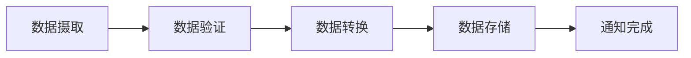

# AWS Durable Functions 持久化函数

## 概述

AWS Durable Functions（持久化函数）是通过 AWS Step Functions 实现的一种服务编排模式，允许开发者构建可靠、可扩展的分布式应用程序。这些函数能够在长时间运行的工作流中保持状态，并在失败时自动恢复。

## 核心特性

### 1. 状态管理
- **持久化状态**: 工作流状态自动保存到 AWS 托管的存储中
- **容错性**: 在系统失败或重启后能够从上次状态继续执行
- **状态可视化**: 通过 AWS 控制台实时查看执行状态

### 2. 分布式编排
- **服务集成**: 原生集成 200+ AWS 服务
- **并行执行**: 支持并行分支和条件逻辑
- **错误处理**: 内置重试、回退和错误捕获机制

### 3. 可扩展性
- **自动扩缩容**: 根据工作负载自动调整资源
- **无服务器**: 无需管理底层基础设施
- **高可用性**: 多可用区部署确保高可用性

## 主要组件

### Step Functions
AWS Step Functions 是实现 Durable Functions 的核心服务：

```json
{
  "Comment": "简单的 Hello World 工作流",
  "StartAt": "HelloWorld",
  "States": {
    "HelloWorld": {
      "Type": "Task",
      "Resource": "arn:aws:lambda:region:account:function:HelloWorld",
      "End": true
    }
  }
}
```

### Workflow Types
1. **Standard Workflows**: 长时间运行的工作流（最长 1 年）
2. **Express Workflows**: 高并发、短时间运行的工作流

## 最新功能和改进

### 2024年重要更新

#### 1. 增强的错误处理
- **智能重试**: 基于机器学习的重试策略优化
- **断路器模式**: 防止级联失败的自动断路机制
- **错误分类**: 自动分类和处理不同类型的错误

#### 2. 性能优化
- **冷启动优化**: 减少 Lambda 函数冷启动时间
- **状态机缓存**: 提高状态转换性能
- **批处理支持**: 优化批量数据处理场景

#### 3. 开发者体验改进
- **本地开发工具**: Step Functions Local 增强调试功能
- **可视化编辑器**: 拖拽式工作流设计器
- **模板库**: 预建的常用工作流模板

#### 4. 集成增强
- **Amazon Bedrock 集成**: 支持 AI/ML 工作流编排
- **EventBridge 增强**: 改进的事件驱动架构支持
- **Container 支持**: 原生支持容器化工作负载

## 使用场景

### 1. 数据处理管道


### 2. 订单处理工作流
- 订单验证
- 库存检查
- 支付处理
- 发货安排
- 客户通知

### 3. 机器学习管道
- 数据预处理
- 模型训练
- 模型评估
- 模型部署
- 监控和反馈

### 4. 微服务编排
- 服务调用链管理
- 补偿事务处理
- 服务健康检查
- 负载均衡

## 最佳实践

### 1. 设计原则
- **幂等性**: 确保状态转换的幂等性
- **超时设置**: 合理配置任务和工作流超时
- **错误边界**: 明确定义错误处理边界

### 2. 性能优化
```javascript
// Lambda 函数优化示例
exports.handler = async (event) => {
    // 使用连接池
    const connection = await getConnectionFromPool();
    
    try {
        // 业务逻辑
        const result = await processData(event, connection);
        return {
            statusCode: 200,
            body: JSON.stringify(result)
        };
    } finally {
        // 确保资源清理
        await releaseConnection(connection);
    }
};
```

### 3. 监控和调试
- **CloudWatch 集成**: 设置合适的监控指标
- **X-Ray 追踪**: 启用分布式追踪
- **日志记录**: 结构化日志记录

## 定价模型

### Standard Workflows
- 状态转换: $0.025 每 1000 次转换
- 无额外的持续时间费用

### Express Workflows
- 请求: $1.00 每 100 万次请求
- 持续时间: $0.06 每 GB-小时

## 安全考虑

### 1. 权限管理
- **IAM 角色**: 最小权限原则
- **资源策略**: 细粒度访问控制
- **加密**: 静态和传输中数据加密

### 2. 网络安全
- **VPC 端点**: 私有网络访问
- **安全组**: 网络访问控制
- **WAF 集成**: Web 应用防火墙保护

## 与其他解决方案比较

| 特性 | AWS Step Functions | Azure Durable Functions | Google Cloud Workflows |
|------|-------------------|-------------------------|------------------------|
| 编程模型 | 声明式 JSON/YAML | 代码优先 | 声明式 YAML |
| 状态管理 | 自动 | 自动 | 自动 |
| 本地开发 | 模拟器 | 本地运行时 | 模拟器 |
| 定价模型 | 按转换计费 | 按执行时间计费 | 按步骤计费 |

## 迁移指南

### 从传统工作流迁移
1. **评估现有工作流**: 识别状态和转换
2. **设计状态机**: 将逻辑映射到 Step Functions
3. **分阶段迁移**: 逐步替换现有组件
4. **测试验证**: 确保业务逻辑正确性

### 代码示例: 简单的审批工作流
```json
{
  "Comment": "文档审批工作流",
  "StartAt": "SubmitForReview",
  "States": {
    "SubmitForReview": {
      "Type": "Task",
      "Resource": "arn:aws:lambda:region:account:function:SubmitReview",
      "Next": "WaitForApproval"
    },
    "WaitForApproval": {
      "Type": "Wait",
      "Seconds": 300,
      "Next": "CheckApprovalStatus"
    },
    "CheckApprovalStatus": {
      "Type": "Task",
      "Resource": "arn:aws:lambda:region:account:function:CheckStatus",
      "Next": "ApprovalChoice"
    },
    "ApprovalChoice": {
      "Type": "Choice",
      "Choices": [
        {
          "Variable": "$.status",
          "StringEquals": "APPROVED",
          "Next": "ProcessApproved"
        },
        {
          "Variable": "$.status",
          "StringEquals": "REJECTED",
          "Next": "ProcessRejected"
        }
      ],
      "Default": "WaitForApproval"
    },
    "ProcessApproved": {
      "Type": "Task",
      "Resource": "arn:aws:lambda:region:account:function:ProcessApproved",
      "End": true
    },
    "ProcessRejected": {
      "Type": "Task",
      "Resource": "arn:aws:lambda:region:account:function:ProcessRejected",
      "End": true
    }
  }
}
```

## 总结

AWS Durable Functions 通过 Step Functions 提供了强大的分布式应用编排能力。随着最新的功能更新和性能改进，它已成为构建可靠、可扩展的云原生应用的重要工具。无论是数据处理管道、业务工作流还是微服务编排，AWS Durable Functions 都能提供企业级的解决方案。

## 相关资源

- [AWS Step Functions 官方文档](https://docs.aws.amazon.com/step-functions/)
- [Step Functions Workshop](https://step-functions-workshop.go-aws.com/)
- [AWS 架构中心 - 工作流模式](https://aws.amazon.com/architecture/workflows/)
- [Step Functions 最佳实践](https://docs.aws.amazon.com/step-functions/latest/dg/bp-express.html)