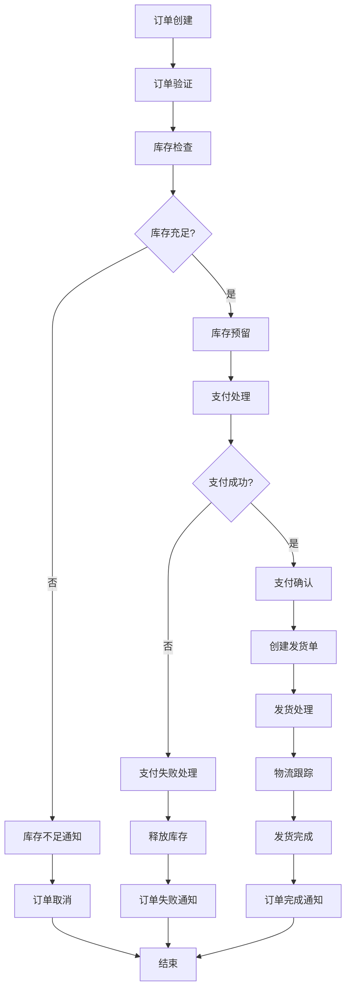

# AWS Durable Function 订单处理工作流演示

## 概述

本演示展示如何使用 AWS Step Functions（Durable Functions）构建一个完整的电商订单处理工作流。该工作流涵盖了从订单创建到完成的整个生命周期，包括库存检查、支付处理、发货安排等关键步骤。

## 工作流架构



## Step Functions 状态机定义

### 主工作流 (order-processing.json)

```json
{
  "Comment": "电商订单处理工作流",
  "StartAt": "ValidateOrder",
  "States": {
    "ValidateOrder": {
      "Type": "Task",
      "Resource": "arn:aws:lambda:us-east-1:123456789012:function:ValidateOrder",
      "ResultPath": "$.validationResult",
      "Retry": [
        {
          "ErrorEquals": ["Lambda.ServiceException", "Lambda.AWSLambdaException"],
          "IntervalSeconds": 2,
          "MaxAttempts": 3,
          "BackoffRate": 2
        }
      ],
      "Catch": [
        {
          "ErrorEquals": ["States.ALL"],
          "Next": "OrderValidationFailed",
          "ResultPath": "$.error"
        }
      ],
      "Next": "CheckInventory"
    },
    
    "CheckInventory": {
      "Type": "Task",
      "Resource": "arn:aws:lambda:us-east-1:123456789012:function:CheckInventory",
      "ResultPath": "$.inventoryResult",
      "Retry": [
        {
          "ErrorEquals": ["Lambda.ServiceException", "Lambda.AWSLambdaException"],
          "IntervalSeconds": 2,
          "MaxAttempts": 3,
          "BackoffRate": 2
        }
      ],
      "Next": "InventoryDecision"
    },
    
    "InventoryDecision": {
      "Type": "Choice",
      "Choices": [
        {
          "Variable": "$.inventoryResult.available",
          "BooleanEquals": true,
          "Next": "ReserveInventory"
        }
      ],
      "Default": "InsufficientInventory"
    },
    
    "ReserveInventory": {
      "Type": "Task",
      "Resource": "arn:aws:lambda:us-east-1:123456789012:function:ReserveInventory",
      "ResultPath": "$.reservationResult",
      "Retry": [
        {
          "ErrorEquals": ["Lambda.ServiceException", "Lambda.AWSLambdaException"],
          "IntervalSeconds": 2,
          "MaxAttempts": 3,
          "BackoffRate": 2
        }
      ],
      "Catch": [
        {
          "ErrorEquals": ["InventoryReservationException"],
          "Next": "InsufficientInventory",
          "ResultPath": "$.error"
        }
      ],
      "Next": "ProcessPayment"
    },
    
    "ProcessPayment": {
      "Type": "Task",
      "Resource": "arn:aws:lambda:us-east-1:123456789012:function:ProcessPayment",
      "ResultPath": "$.paymentResult",
      "TimeoutSeconds": 30,
      "Retry": [
        {
          "ErrorEquals": ["PaymentTemporaryException"],
          "IntervalSeconds": 5,
          "MaxAttempts": 3,
          "BackoffRate": 2
        }
      ],
      "Catch": [
        {
          "ErrorEquals": ["PaymentFailedException"],
          "Next": "PaymentFailed",
          "ResultPath": "$.error"
        }
      ],
      "Next": "PaymentDecision"
    },
    
    "PaymentDecision": {
      "Type": "Choice",
      "Choices": [
        {
          "Variable": "$.paymentResult.status",
          "StringEquals": "SUCCESS",
          "Next": "ConfirmPayment"
        }
      ],
      "Default": "PaymentFailed"
    },
    
    "ConfirmPayment": {
      "Type": "Task",
      "Resource": "arn:aws:lambda:us-east-1:123456789012:function:ConfirmPayment",
      "ResultPath": "$.confirmationResult",
      "Next": "CreateShippingLabel"
    },
    
    "CreateShippingLabel": {
      "Type": "Task",
      "Resource": "arn:aws:lambda:us-east-1:123456789012:function:CreateShippingLabel",
      "ResultPath": "$.shippingResult",
      "Retry": [
        {
          "ErrorEquals": ["Lambda.ServiceException", "Lambda.AWSLambdaException"],
          "IntervalSeconds": 2,
          "MaxAttempts": 3,
          "BackoffRate": 2
        }
      ],
      "Next": "ProcessShipment"
    },
    
    "ProcessShipment": {
      "Type": "Task",
      "Resource": "arn:aws:lambda:us-east-1:123456789012:function:ProcessShipment",
      "ResultPath": "$.shipmentResult",
      "Next": "WaitForShipment"
    },
    
    "WaitForShipment": {
      "Type": "Wait",
      "Seconds": 3600,
      "Next": "CheckShippingStatus"
    },
    
    "CheckShippingStatus": {
      "Type": "Task",
      "Resource": "arn:aws:lambda:us-east-1:123456789012:function:CheckShippingStatus",
      "ResultPath": "$.shippingStatusResult",
      "Next": "ShippingStatusDecision"
    },
    
    "ShippingStatusDecision": {
      "Type": "Choice",
      "Choices": [
        {
          "Variable": "$.shippingStatusResult.status",
          "StringEquals": "SHIPPED",
          "Next": "OrderCompleted"
        },
        {
          "Variable": "$.shippingStatusResult.status",
          "StringEquals": "IN_TRANSIT",
          "Next": "WaitForShipment"
        }
      ],
      "Default": "ShippingFailed"
    },
    
    "OrderCompleted": {
      "Type": "Task",
      "Resource": "arn:aws:lambda:us-east-1:123456789012:function:SendOrderCompletionNotification",
      "Next": "Success"
    },
    
    "InsufficientInventory": {
      "Type": "Task",
      "Resource": "arn:aws:lambda:us-east-1:123456789012:function:SendInsufficientInventoryNotification",
      "Next": "CancelOrder"
    },
    
    "PaymentFailed": {
      "Type": "Task",
      "Resource": "arn:aws:lambda:us-east-1:123456789012:function:ReleaseInventory",
      "Next": "SendPaymentFailedNotification"
    },
    
    "SendPaymentFailedNotification": {
      "Type": "Task",
      "Resource": "arn:aws:lambda:us-east-1:123456789012:function:SendPaymentFailedNotification",
      "Next": "CancelOrder"
    },
    
    "ShippingFailed": {
      "Type": "Task",
      "Resource": "arn:aws:lambda:us-east-1:123456789012:function:SendShippingFailedNotification",
      "Next": "CancelOrder"
    },
    
    "OrderValidationFailed": {
      "Type": "Task",
      "Resource": "arn:aws:lambda:us-east-1:123456789012:function:SendValidationFailedNotification",
      "Next": "CancelOrder"
    },
    
    "CancelOrder": {
      "Type": "Task",
      "Resource": "arn:aws:lambda:us-east-1:123456789012:function:CancelOrder",
      "Next": "Failure"
    },
    
    "Success": {
      "Type": "Succeed"
    },
    
    "Failure": {
      "Type": "Fail",
      "Cause": "订单处理失败"
    }
  }
}
```

## Lambda 函数实现

### 1. 订单验证函数 (validate-order.js)

```javascript
const AWS = require('aws-sdk');
const dynamodb = new AWS.DynamoDB.DocumentClient();

exports.handler = async (event) => {
    console.log('开始验证订单:', JSON.stringify(event, null, 2));
    
    try {
        const { orderId, customerId, items, totalAmount } = event;
        
        // 基本字段验证
        if (!orderId || !customerId || !items || !totalAmount) {
            throw new Error('缺少必需的订单字段');
        }
        
        // 验证商品格式
        if (!Array.isArray(items) || items.length === 0) {
            throw new Error('订单必须包含至少一个商品');
        }
        
        // 验证每个商品项
        for (const item of items) {
            if (!item.productId || !item.quantity || item.quantity <= 0) {
                throw new Error('无效的商品信息');
            }
        }
        
        // 验证总金额
        if (totalAmount <= 0) {
            throw new Error('订单总额必须大于0');
        }
        
        // 验证客户信息
        const customer = await dynamodb.get({
            TableName: 'Customers',
            Key: { customerId }
        }).promise();
        
        if (!customer.Item) {
            throw new Error('客户不存在');
        }
        
        if (customer.Item.status !== 'ACTIVE') {
            throw new Error('客户账户已被禁用');
        }
        
        // 保存订单到数据库
        await dynamodb.put({
            TableName: 'Orders',
            Item: {
                orderId,
                customerId,
                items,
                totalAmount,
                status: 'VALIDATED',
                createdAt: new Date().toISOString(),
                updatedAt: new Date().toISOString()
            }
        }).promise();
        
        console.log('订单验证成功:', orderId);
        
        return {
            statusCode: 200,
            valid: true,
            orderId,
            message: '订单验证成功'
        };
        
    } catch (error) {
        console.error('订单验证失败:', error.message);
        throw new Error(`订单验证失败: ${error.message}`);
    }
};
```

### 2. 库存检查函数 (check-inventory.js)

```javascript
const AWS = require('aws-sdk');
const dynamodb = new AWS.DynamoDB.DocumentClient();

exports.handler = async (event) => {
    console.log('开始检查库存:', JSON.stringify(event, null, 2));
    
    try {
        const { items } = event;
        let allItemsAvailable = true;
        const inventoryDetails = [];
        
        for (const item of items) {
            const { productId, quantity } = item;
            
            // 查询产品库存
            const product = await dynamodb.get({
                TableName: 'Inventory',
                Key: { productId }
            }).promise();
            
            if (!product.Item) {
                allItemsAvailable = false;
                inventoryDetails.push({
                    productId,
                    requestedQuantity: quantity,
                    availableQuantity: 0,
                    available: false,
                    reason: '产品不存在'
                });
                continue;
            }
            
            const availableQuantity = product.Item.quantity || 0;
            const available = availableQuantity >= quantity;
            
            inventoryDetails.push({
                productId,
                requestedQuantity: quantity,
                availableQuantity,
                available,
                reason: available ? '库存充足' : '库存不足'
            });
            
            if (!available) {
                allItemsAvailable = false;
            }
        }
        
        console.log('库存检查完成:', { available: allItemsAvailable, details: inventoryDetails });
        
        return {
            statusCode: 200,
            available: allItemsAvailable,
            inventoryDetails,
            timestamp: new Date().toISOString()
        };
        
    } catch (error) {
        console.error('库存检查失败:', error.message);
        throw new Error(`库存检查失败: ${error.message}`);
    }
};
```

### 3. 库存预留函数 (reserve-inventory.js)

```javascript
const AWS = require('aws-sdk');
const dynamodb = new AWS.DynamoDB.DocumentClient();
const { v4: uuidv4 } = require('uuid');

exports.handler = async (event) => {
    console.log('开始预留库存:', JSON.stringify(event, null, 2));
    
    try {
        const { orderId, items } = event;
        const reservationId = uuidv4();
        const reservations = [];
        
        // 使用事务确保原子性
        const transactItems = [];
        
        for (const item of items) {
            const { productId, quantity } = item;
            
            // 检查当前库存
            const product = await dynamodb.get({
                TableName: 'Inventory',
                Key: { productId }
            }).promise();
            
            if (!product.Item || product.Item.quantity < quantity) {
                throw new Error(`产品 ${productId} 库存不足`);
            }
            
            // 添加到事务中 - 减少库存
            transactItems.push({
                Update: {
                    TableName: 'Inventory',
                    Key: { productId },
                    UpdateExpression: 'SET quantity = quantity - :qty, reservedQuantity = reservedQuantity + :qty, updatedAt = :timestamp',
                    ExpressionAttributeValues: {
                        ':qty': quantity,
                        ':timestamp': new Date().toISOString()
                    },
                    ConditionExpression: 'quantity >= :qty'
                }
            });
            
            // 添加预留记录
            const reservation = {
                reservationId,
                orderId,
                productId,
                quantity,
                status: 'ACTIVE',
                createdAt: new Date().toISOString(),
                expiresAt: new Date(Date.now() + 30 * 60 * 1000).toISOString() // 30分钟过期
            };
            
            transactItems.push({
                Put: {
                    TableName: 'InventoryReservations',
                    Item: reservation
                }
            });
            
            reservations.push(reservation);
        }
        
        // 执行事务
        await dynamodb.transactWrite({
            TransactItems: transactItems
        }).promise();
        
        console.log('库存预留成功:', reservationId);
        
        return {
            statusCode: 200,
            reservationId,
            reservations,
            message: '库存预留成功'
        };
        
    } catch (error) {
        console.error('库存预留失败:', error.message);
        
        if (error.code === 'TransactionCanceledException') {
            throw new Error('InventoryReservationException: 库存不足，无法完成预留');
        }
        
        throw new Error(`库存预留失败: ${error.message}`);
    }
};
```

### 4. 支付处理函数 (process-payment.js)

```javascript
const AWS = require('aws-sdk');
const dynamodb = new AWS.DynamoDB.DocumentClient();

// 模拟第三方支付服务
class PaymentService {
    static async processPayment(paymentInfo) {
        // 模拟支付处理延迟
        await new Promise(resolve => setTimeout(resolve, 2000));
        
        // 模拟支付失败场景 (10% 概率)
        if (Math.random() < 0.1) {
            throw new Error('支付网关暂时不可用');
        }
        
        // 模拟支付拒绝场景 (5% 概率)
        if (Math.random() < 0.05) {
            return {
                status: 'DECLINED',
                transactionId: null,
                reason: '银行卡余额不足'
            };
        }
        
        return {
            status: 'SUCCESS',
            transactionId: `txn_${Date.now()}_${Math.random().toString(36).substring(2, 9)}`,
            reason: '支付成功'
        };
    }
}

exports.handler = async (event) => {
    console.log('开始处理支付:', JSON.stringify(event, null, 2));
    
    try {
        const { orderId, customerId, totalAmount } = event;
        
        // 获取客户支付信息
        const customer = await dynamodb.get({
            TableName: 'Customers',
            Key: { customerId }
        }).promise();
        
        if (!customer.Item || !customer.Item.paymentMethod) {
            throw new Error('PaymentFailedException: 客户支付方式不可用');
        }
        
        const paymentInfo = {
            customerId,
            orderId,
            amount: totalAmount,
            currency: 'CNY',
            paymentMethod: customer.Item.paymentMethod
        };
        
        // 调用支付服务
        const paymentResult = await PaymentService.processPayment(paymentInfo);
        
        // 保存支付记录
        const paymentRecord = {
            paymentId: paymentResult.transactionId || `failed_${Date.now()}`,
            orderId,
            customerId,
            amount: totalAmount,
            currency: 'CNY',
            status: paymentResult.status,
            transactionId: paymentResult.transactionId,
            reason: paymentResult.reason,
            createdAt: new Date().toISOString()
        };
        
        await dynamodb.put({
            TableName: 'Payments',
            Item: paymentRecord
        }).promise();
        
        if (paymentResult.status !== 'SUCCESS') {
            throw new Error(`PaymentFailedException: ${paymentResult.reason}`);
        }
        
        console.log('支付处理成功:', paymentResult.transactionId);
        
        return {
            statusCode: 200,
            status: 'SUCCESS',
            transactionId: paymentResult.transactionId,
            message: '支付成功'
        };
        
    } catch (error) {
        console.error('支付处理失败:', error.message);
        
        if (error.message.includes('PaymentFailedException')) {
            throw error;
        }
        
        throw new Error(`PaymentTemporaryException: ${error.message}`);
    }
};
```

### 5. 发货处理函数 (create-shipping-label.js)

```javascript
const AWS = require('aws-sdk');
const dynamodb = new AWS.DynamoDB.DocumentClient();

exports.handler = async (event) => {
    console.log('开始创建发货标签:', JSON.stringify(event, null, 2));
    
    try {
        const { orderId, customerId } = event;
        
        // 获取客户收货地址
        const customer = await dynamodb.get({
            TableName: 'Customers',
            Key: { customerId }
        }).promise();
        
        if (!customer.Item || !customer.Item.shippingAddress) {
            throw new Error('客户收货地址不完整');
        }
        
        // 获取订单详情
        const order = await dynamodb.get({
            TableName: 'Orders',
            Key: { orderId }
        }).promise();
        
        if (!order.Item) {
            throw new Error('订单不存在');
        }
        
        // 生成发货标签
        const shippingLabel = {
            shippingId: `ship_${Date.now()}_${Math.random().toString(36).substring(2, 9)}`,
            orderId,
            customerId,
            shippingAddress: customer.Item.shippingAddress,
            items: order.Item.items,
            carrier: 'SF_EXPRESS', // 顺丰快递
            serviceType: 'STANDARD',
            weight: this.calculateWeight(order.Item.items),
            dimensions: this.calculateDimensions(order.Item.items),
            createdAt: new Date().toISOString(),
            status: 'CREATED'
        };
        
        // 保存发货信息
        await dynamodb.put({
            TableName: 'Shipments',
            Item: shippingLabel
        }).promise();
        
        // 更新订单状态
        await dynamodb.update({
            TableName: 'Orders',
            Key: { orderId },
            UpdateExpression: 'SET #status = :status, shippingId = :shippingId, updatedAt = :timestamp',
            ExpressionAttributeNames: {
                '#status': 'status'
            },
            ExpressionAttributeValues: {
                ':status': 'SHIPPING_CREATED',
                ':shippingId': shippingLabel.shippingId,
                ':timestamp': new Date().toISOString()
            }
        }).promise();
        
        console.log('发货标签创建成功:', shippingLabel.shippingId);
        
        return {
            statusCode: 200,
            shippingId: shippingLabel.shippingId,
            carrier: shippingLabel.carrier,
            trackingNumber: shippingLabel.shippingId,
            message: '发货标签创建成功'
        };
        
    } catch (error) {
        console.error('创建发货标签失败:', error.message);
        throw new Error(`创建发货标签失败: ${error.message}`);
    }
};

// 计算包裹重量（基于商品类型的估算）
exports.calculateWeight = (items) => {
    return items.reduce((total, item) => {
        // 假设每个商品重量为 0.5kg
        return total + (item.quantity * 0.5);
    }, 0);
};

// 计算包裹尺寸
exports.calculateDimensions = (items) => {
    const totalItems = items.reduce((sum, item) => sum + item.quantity, 0);
    
    // 基于商品数量估算包装尺寸
    if (totalItems <= 2) {
        return { length: 20, width: 15, height: 10 }; // 小包装
    } else if (totalItems <= 5) {
        return { length: 30, width: 25, height: 15 }; // 中包装
    } else {
        return { length: 40, width: 35, height: 20 }; // 大包装
    }
};
```

### 6. 通知服务函数 (send-notifications.js)

```javascript
const AWS = require('aws-sdk');
const ses = new AWS.SES();
const sns = new AWS.SNS();
const dynamodb = new AWS.DynamoDB.DocumentClient();

class NotificationService {
    static async sendEmail(to, subject, body) {
        const params = {
            Source: 'noreply@yourstore.com',
            Destination: {
                ToAddresses: [to]
            },
            Message: {
                Subject: { Data: subject },
                Body: { Html: { Data: body } }
            }
        };
        
        await ses.sendEmail(params).promise();
    }
    
    static async sendSMS(phoneNumber, message) {
        const params = {
            PhoneNumber: phoneNumber,
            Message: message
        };
        
        await sns.publish(params).promise();
    }
}

// 订单完成通知
exports.sendOrderCompletionNotification = async (event) => {
    try {
        const { orderId, customerId } = event;
        
        const customer = await dynamodb.get({
            TableName: 'Customers',
            Key: { customerId }
        }).promise();
        
        if (customer.Item) {
            const emailBody = `
                <h2>订单配送完成</h2>
                <p>亲爱的${customer.Item.name}，</p>
                <p>您的订单 ${orderId} 已成功配送完成。</p>
                <p>感谢您的购买！</p>
            `;
            
            await NotificationService.sendEmail(
                customer.Item.email,
                '订单配送完成',
                emailBody
            );
            
            if (customer.Item.phoneNumber) {
                await NotificationService.sendSMS(
                    customer.Item.phoneNumber,
                    `您的订单 ${orderId} 已配送完成，感谢购买！`
                );
            }
        }
        
        return { statusCode: 200, message: '通知发送成功' };
    } catch (error) {
        console.error('发送订单完成通知失败:', error);
        throw error;
    }
};

// 库存不足通知
exports.sendInsufficientInventoryNotification = async (event) => {
    try {
        const { orderId, customerId, inventoryDetails } = event;
        
        const customer = await dynamodb.get({
            TableName: 'Customers',
            Key: { customerId }
        }).promise();
        
        if (customer.Item) {
            const outOfStockItems = inventoryDetails?.inventoryDetails
                ?.filter(item => !item.available)
                ?.map(item => item.productId)
                ?.join(', ');
            
            const emailBody = `
                <h2>订单库存不足</h2>
                <p>亲爱的${customer.Item.name}，</p>
                <p>很抱歉，您的订单 ${orderId} 中的以下商品库存不足：</p>
                <p>${outOfStockItems}</p>
                <p>订单已被取消，我们深表歉意。</p>
            `;
            
            await NotificationService.sendEmail(
                customer.Item.email,
                '订单库存不足',
                emailBody
            );
        }
        
        return { statusCode: 200, message: '库存不足通知发送成功' };
    } catch (error) {
        console.error('发送库存不足通知失败:', error);
        throw error;
    }
};

// 支付失败通知
exports.sendPaymentFailedNotification = async (event) => {
    try {
        const { orderId, customerId, error } = event;
        
        const customer = await dynamodb.get({
            TableName: 'Customers',
            Key: { customerId }
        }).promise();
        
        if (customer.Item) {
            const emailBody = `
                <h2>支付失败</h2>
                <p>亲爱的${customer.Item.name}，</p>
                <p>您的订单 ${orderId} 支付失败。</p>
                <p>失败原因：${error?.Cause || '支付处理异常'}</p>
                <p>请检查您的支付方式并重新下单。</p>
            `;
            
            await NotificationService.sendEmail(
                customer.Item.email,
                '订单支付失败',
                emailBody
            );
        }
        
        return { statusCode: 200, message: '支付失败通知发送成功' };
    } catch (error) {
        console.error('发送支付失败通知失败:', error);
        throw error;
    }
};
```

## 部署配置

### CloudFormation 模板 (order-workflow.yaml)

```yaml
AWSTemplateFormatVersion: '2010-09-09'
Description: '订单处理工作流资源'

Parameters:
  Environment:
    Type: String
    Default: 'dev'
    AllowedValues: ['dev', 'staging', 'prod']

Resources:
  # IAM Role for Step Functions
  StepFunctionsRole:
    Type: AWS::IAM::Role
    Properties:
      AssumeRolePolicyDocument:
        Version: '2012-10-17'
        Statement:
          - Effect: Allow
            Principal:
              Service: states.amazonaws.com
            Action: sts:AssumeRole
      Policies:
        - PolicyName: StepFunctionsExecutionPolicy
          PolicyDocument:
            Version: '2012-10-17'
            Statement:
              - Effect: Allow
                Action:
                  - lambda:InvokeFunction
                Resource: !Sub 'arn:aws:lambda:${AWS::Region}:${AWS::AccountId}:function:order-*'
              - Effect: Allow
                Action:
                  - logs:CreateLogGroup
                  - logs:CreateLogStream
                  - logs:PutLogEvents
                Resource: '*'

  # IAM Role for Lambda Functions
  LambdaExecutionRole:
    Type: AWS::IAM::Role
    Properties:
      AssumeRolePolicyDocument:
        Version: '2012-10-17'
        Statement:
          - Effect: Allow
            Principal:
              Service: lambda.amazonaws.com
            Action: sts:AssumeRole
      ManagedPolicyArns:
        - arn:aws:iam::aws:policy/service-role/AWSLambdaBasicExecutionRole
      Policies:
        - PolicyName: DynamoDBAccess
          PolicyDocument:
            Version: '2012-10-17'
            Statement:
              - Effect: Allow
                Action:
                  - dynamodb:GetItem
                  - dynamodb:PutItem
                  - dynamodb:UpdateItem
                  - dynamodb:DeleteItem
                  - dynamodb:Query
                  - dynamodb:Scan
                  - dynamodb:TransactWrite
                Resource:
                  - !GetAtt OrdersTable.Arn
                  - !GetAtt CustomersTable.Arn
                  - !GetAtt InventoryTable.Arn
                  - !GetAtt PaymentsTable.Arn
                  - !GetAtt ShipmentsTable.Arn
                  - !GetAtt InventoryReservationsTable.Arn
        - PolicyName: NotificationAccess
          PolicyDocument:
            Version: '2012-10-17'
            Statement:
              - Effect: Allow
                Action:
                  - ses:SendEmail
                  - sns:Publish
                Resource: '*'

  # DynamoDB Tables
  OrdersTable:
    Type: AWS::DynamoDB::Table
    Properties:
      TableName: !Sub 'Orders-${Environment}'
      AttributeDefinitions:
        - AttributeName: orderId
          AttributeType: S
      KeySchema:
        - AttributeName: orderId
          KeyType: HASH
      BillingMode: PAY_PER_REQUEST

  CustomersTable:
    Type: AWS::DynamoDB::Table
    Properties:
      TableName: !Sub 'Customers-${Environment}'
      AttributeDefinitions:
        - AttributeName: customerId
          AttributeType: S
      KeySchema:
        - AttributeName: customerId
          KeyType: HASH
      BillingMode: PAY_PER_REQUEST

  InventoryTable:
    Type: AWS::DynamoDB::Table
    Properties:
      TableName: !Sub 'Inventory-${Environment}'
      AttributeDefinitions:
        - AttributeName: productId
          AttributeType: S
      KeySchema:
        - AttributeName: productId
          KeyType: HASH
      BillingMode: PAY_PER_REQUEST

  PaymentsTable:
    Type: AWS::DynamoDB::Table
    Properties:
      TableName: !Sub 'Payments-${Environment}'
      AttributeDefinitions:
        - AttributeName: paymentId
          AttributeType: S
      KeySchema:
        - AttributeName: paymentId
          KeyType: HASH
      BillingMode: PAY_PER_REQUEST

  ShipmentsTable:
    Type: AWS::DynamoDB::Table
    Properties:
      TableName: !Sub 'Shipments-${Environment}'
      AttributeDefinitions:
        - AttributeName: shippingId
          AttributeType: S
      KeySchema:
        - AttributeName: shippingId
          KeyType: HASH
      BillingMode: PAY_PER_REQUEST

  InventoryReservationsTable:
    Type: AWS::DynamoDB::Table
    Properties:
      TableName: !Sub 'InventoryReservations-${Environment}'
      AttributeDefinitions:
        - AttributeName: reservationId
          AttributeType: S
      KeySchema:
        - AttributeName: reservationId
          KeyType: HASH
      BillingMode: PAY_PER_REQUEST
      TimeToLiveSpecification:
        AttributeName: expiresAt
        Enabled: true

  # Step Functions State Machine
  OrderProcessingStateMachine:
    Type: AWS::StepFunctions::StateMachine
    Properties:
      StateMachineName: !Sub 'OrderProcessing-${Environment}'
      RoleArn: !GetAtt StepFunctionsRole.Arn
      DefinitionString: !Sub |
        {
          "Comment": "电商订单处理工作流",
          "StartAt": "ValidateOrder",
          "States": {
            "ValidateOrder": {
              "Type": "Task",
              "Resource": "${ValidateOrderFunction.Arn}",
              "Next": "CheckInventory"
            }
          }
        }

Outputs:
  StateMachineArn:
    Description: 'ARN of the Step Functions state machine'
    Value: !Ref OrderProcessingStateMachine
  
  OrdersTableName:
    Description: 'Name of the Orders table'
    Value: !Ref OrdersTable
```

## 使用示例

### 启动订单处理工作流

```javascript
const AWS = require('aws-sdk');
const stepfunctions = new AWS.StepFunctions();

async function processOrder(orderData) {
    const params = {
        stateMachineArn: 'arn:aws:states:us-east-1:123456789012:stateMachine:OrderProcessing-dev',
        input: JSON.stringify(orderData),
        name: `order-${orderData.orderId}-${Date.now()}`
    };
    
    try {
        const result = await stepfunctions.startExecution(params).promise();
        console.log('工作流启动成功:', result.executionArn);
        return result;
    } catch (error) {
        console.error('启动工作流失败:', error);
        throw error;
    }
}

// 示例订单数据
const orderData = {
    orderId: 'ORD-2024-001',
    customerId: 'CUST-12345',
    items: [
        {
            productId: 'PROD-001',
            quantity: 2
        },
        {
            productId: 'PROD-002', 
            quantity: 1
        }
    ],
    totalAmount: 299.99
};

processOrder(orderData);
```

### 监控工作流执行

```javascript
async function monitorExecution(executionArn) {
    try {
        const result = await stepfunctions.describeExecution({
            executionArn
        }).promise();
        
        console.log('执行状态:', result.status);
        console.log('输入:', result.input);
        console.log('输出:', result.output);
        
        return result;
    } catch (error) {
        console.error('获取执行状态失败:', error);
        throw error;
    }
}
```

## 最佳实践总结

### 1. 错误处理策略
- 使用指数退避重试机制
- 区分可重试和不可重试错误
- 实现断路器模式防止级联失败

### 2. 状态管理
- 保持状态转换的幂等性
- 使用 TTL 自动清理过期预留
- 实现状态版本控制

### 3. 性能优化
- 使用 Express Workflows 处理高频操作
- 实现异步通知减少等待时间
- 合理设置超时和重试参数

### 4. 监控和告警
- 设置关键指标监控
- 实现实时告警机制
- 建立运维仪表板

这个演示展示了如何使用 AWS Step Functions 构建一个完整、可靠的订单处理工作流，涵盖了实际生产环境中的各种场景和最佳实践。